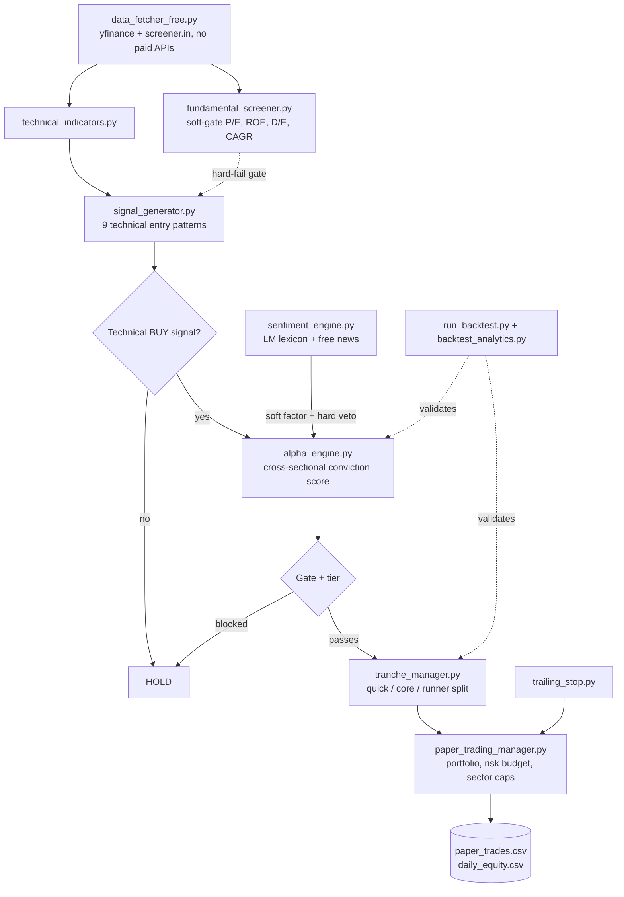

<div align="center">

# NSE Swing Trading Bot

**A fully automated, free-data-only quantitative research platform for the Indian equity market —
paper trading, cross-sectional alpha scoring, NLP-based news sentiment, and a rigorous
A/B/C backtesting harness, running unattended on GitHub Actions.**

[](https://www.python.org/)
[](.github/workflows/main.yml)
[](#data--zero-paid-apis)
[](LICENSE)

</div>

---

## What this is

This is a swing-trading system for NSE (India) equities that scans a ~106-stock universe every
trading day, scores every candidate through five independent layers of analysis, and paper-trades
the result — no real capital, full transparency, every decision logged and explainable.

It is **not** a script that fires off buy signals from one indicator. It's a small research
platform: a technical signal layer, a cross-sectional alpha-ranking engine, an NLP sentiment
engine, a multi-layer risk-management system, and a backtesting harness built specifically to
answer *"is this actually working"* rather than just *"does this run."* Every non-trivial
subsystem below has its own test suite validating its mechanics against known, hand-constructed
inputs — the project's own working principle is that a plausible-sounding trading idea and a
verified one are not the same thing, and the gap between them is worth the engineering effort.

**Status:** actively trading on paper, once daily, fully unattended. See
[Live track record](#live-track-record) for the honest, current numbers — including the losses.

---

## Table of contents

- [Architecture](#architecture)
- [The five scoring layers](#the-five-scoring-layers)
  1. [Technical signal generation](#1-technical-signal-generation)
  2. [Fundamental screening](#2-fundamental-screening)
  3. [Cross-sectional alpha engine](#3-cross-sectional-alpha-engine)
  4. [News sentiment engine](#4-news-sentiment-engine)
  5. [Risk management](#5-risk-management)
- [Trade lifecycle: entries, tranches, exits](#trade-lifecycle-entries-tranches-exits)
- [Backtesting & validation](#backtesting--validation)
- [Data — zero paid APIs](#data--zero-paid-apis)
- [Repository structure](#repository-structure)
- [Getting started](#getting-started)
- [Automation](#automation)
- [Testing](#testing)
- [Live track record](#live-track-record)
- [Design philosophy](#design-philosophy)
- [Roadmap](#roadmap)
- [Disclaimer](#disclaimer)

---

## Architecture



Every box above is its own module with its own test file. Nothing here is a monolithic script —
the alpha engine doesn't know how sentiment is computed, the backtester doesn't know how live
trading persists state, and both use the *same* tranche and trailing-stop logic via shared
modules rather than duplicated copies that could drift apart.

---

## The five scoring layers

### 1. Technical signal generation
`signal_generator.py` — a high-risk/high-frequency configuration tuned for momentum capture,
scanning for **9 independent entry patterns**: breakout, pullback, bullish engulfing, RSI
divergence, stochastic cross, momentum burst, Bollinger Band squeeze, EMA cross, and Chaikin
Money Flow accumulation. Position sizing is risk-based (4% of equity at risk per trade, capped at
40% of equity in any one name), with stop-loss/target multipliers that vary by pattern type.
Market regime (trend vs. range) feeds into entry filtering.

### 2. Fundamental screening
`fundamental_screener.py` — a **soft gate**, not a hard filter: P/E, debt-to-equity, ROE, current
ratio, and earnings CAGR are scored and only block a trade on genuine red flags (e.g. negative
equity), rather than excluding every stock that doesn't look like a value pick — deliberately, for
a momentum-oriented, high-risk strategy where waiting for "cheap" often means missing the move.

### 3. Cross-sectional alpha engine
`alpha_engine.py` (~900 lines) — the conviction layer sitting on top of the technical signal.
Every BUY candidate is scored across **6 factors** — momentum, risk-adjusted momentum, trend
quality, volume conviction, relative strength vs. Nifty, and news sentiment — each **percentile-ranked
against that day's actual scan universe** rather than compared to a fixed threshold, so "good" is
always relative to what the market is actually doing that day. Factor weights tilt automatically
by detected market regime (strong uptrend / downtrend / weak trend / choppy range / high-vol
stress) — e.g. trend-quality and volume-conviction get more weight in choppy markets, where raw
momentum is documented to decay fastest. A composite score sorts every candidate into one of four
conviction tiers, which **gate** whether a technically valid signal is taken at all and **size**
the position accordingly (1.3x for Tier 1, down to 0.5x for Tier 4). Pattern-level historical
performance is recalibrated over time using empirical-Bayes shrinkage toward the population mean,
so a pattern's weight only moves once there's enough closed-trade evidence to trust it, rather
than overreacting to a handful of results.

### 4. News sentiment engine
`sentiment_engine.py` (~1,000 lines) — a Loughran-McDonald-inspired financial-text sentiment
engine, built from scratch specifically because generic sentiment lexicons are a documented poor
fit for financial text (roughly three-quarters of words a generic dictionary tags "negative"
aren't actually negative in a business context — "liability," "tax," "cost" read as bad in
plain English and are routine vocabulary in a 10-K). Headlines are pulled from **two independent
free sources** (Yahoo Finance news via `yfinance`, Google News RSS — no API keys), scored against
a hand-curated financial lexicon with clause-scoped negation handling (so "results were not
impressive, margins weak" doesn't get corrupted by a negator that doesn't actually reach "weak"),
then aggregated with **recency decay** and **small-sample shrinkage toward neutral** — a single
dramatic headline can't swing a decision the way a corroborated cluster can. The result feeds two
places: a small (10%-weight) **soft factor** in the alpha engine's composite score, and an
independent **hard veto gate** that can block a trade outright on a fresh, corroborated
fraud/litigation cluster — the asymmetric case a pure price/volume system is structurally blind to
until the news is already priced in.

### 5. Risk management
Layered, not single-point:
- **Position-level**: ATR/pattern-based stop-loss and target, tiered trailing stop
  (`trailing_stop.py` — breakeven at 1R, locks progressively tighter as the trade runs)
- **Portfolio-level**: aggregate open risk capped at 16% of equity across all positions
  simultaneously, checked before every new entry
- **Sector-level**: max 4 concurrent positions per sector (19-sector taxonomy covering the full
  scan universe), so a correlated cluster of "different" stocks can't quietly become one
  concentrated bet
- **Portfolio-wide circuit breaker**: new entries pause entirely at 35% drawdown from peak equity

---

## Trade lifecycle: entries, tranches, exits

A signal that clears every gate above doesn't open as one block with one target. It splits into
**three tranches** (`tranche_manager.py`), sized 35/35/30%:

| Tranche | Exit target | Purpose |
|---|---|---|
| **Quick** | 1.5R (the strategy's own minimum acceptable R:R) | Locks in "the worst outcome that still justified the entry," early and reliably |
| **Core** | The original planned target (3-4R, pattern-dependent) | The base-case planned outcome |
| **Runner** | No fixed target — rides the trailing stop only | Captures an outsized move a fixed target would have capped |

A fixed single target either captures the whole move up to that price or nothing beyond it. For a
momentum strategy — where the outcome distribution is expected to be right-skewed, most winners
moderate, a few running much further — that's a structural ceiling on exactly the trades where the
skew would otherwise pay off. All three tranches share one entry price and one (ratcheting)
stop-loss; a loss closes all three together, at the same price, on the same bar — a trade can't
"partially survive" a stop-out.

---

## Backtesting & validation

`run_backtest.py` + `backtest_analytics.py` run a **three-way controlled comparison**, not a
single backtest:

- **Run A** — alpha engine ON, tranched exits ON *(current live policy, exactly as deployed)*
- **Run B** — alpha engine ON, tranched exits OFF *(isolates tranching's own marginal effect)*
- **Run C** — alpha engine OFF, untranched *(original pre-alpha-engine baseline)*

A vs. B answers "does scaled-exit tranching actually help, holding everything else constant?" B
vs. C answers the same question for the alpha engine. Full risk-adjusted analytics — Sharpe,
Sortino, Calmar, max drawdown, CAGR, profit factor, expectancy — stratified by conviction tier,
market regime, entry pattern, **and tranche label**, so it's possible to see directly whether the
"runner" tranche is earning its added complexity or just adding noise. The simulation is
walk-forward and point-in-time correct (verified by an explicit lookahead-bias test: a deliberately
unmistakable future price shock injected into the data has zero effect on any decision made before
it) — not a vectorized shortcut that could leak future information into a past decision.

---

## Data — zero paid APIs

Every data source is free, with no API key required: `yfinance` for OHLCV history and news,
`BeautifulSoup`-based scraping of screener.in for fundamentals, Google News RSS for supplementary
sentiment coverage. Every fetch path has retry-with-backoff and defensive multi-schema parsing
(free data sources change their response shape without notice far more often than paid ones), and
every subsystem degrades gracefully rather than crashing the whole run — a missing sentiment
reading for one symbol is treated as "no opinion," never as a penalty.

---

## Repository structure

```
Execution scripts
├── run_paper_trading.py      Daily orchestrator — the script GitHub Actions actually runs
├── run_backtest.py           A/B/C backtest validation harness
├── run_live_screening.py     Manual/ad-hoc scan + email alert tool (not part of the automated run)
└── swing_trading_bot.py      Bot orchestration class + walk-forward backtest simulator

Scoring & decision engines
├── signal_generator.py       Technical entry patterns, stop/target, position sizing
├── fundamental_screener.py   Soft-gate fundamental scoring
├── alpha_engine.py           Cross-sectional conviction scoring, regime detection
├── sentiment_engine.py       LM-inspired news sentiment, soft factor + hard veto
├── trailing_stop.py          Shared tiered trailing-stop calculation
└── tranche_manager.py        Shared quick/core/runner scaled-exit logic

Infrastructure
├── data_fetcher_free.py      Free-data ingestion (yfinance + screener.in), retry/backoff
├── paper_trading_manager.py  Portfolio state, CSV persistence, trade lifecycle
├── notification_handler.py   Email/SMS alerts
└── backtest_analytics.py     Sharpe/Sortino/Calmar/drawdown/profit-factor reporting

Tests (one file per subsystem above)
├── test_signal_generator.py, test_fundamental_screener.py, test_technical_indicators.py
├── test_sentiment_engine.py       37 checks: lexicon, negation, decay, shrinkage, veto gate
├── test_tranche_backtest.py       16 checks: independent tranche exits, shared stop, backward compat
├── test_data_fetcher_free.py, test_notification_handler.py, test_swing_trading_bot.py

State (persisted, committed back to the repo by the automated workflow)
├── paper_trades.csv          Every trade, every tranche, every field — full audit trail
└── daily_equity.csv          Daily portfolio equity snapshot
```

---

## Getting started

```bash
git clone https://github.com/<your-username>/<repo-name>.git
cd <repo-name>
pip install -r requirements.txt --break-system-packages   # or use a virtualenv

# Run a single scan/trade cycle locally
python run_paper_trading.py

# Run the full A/B/C backtest (takes a while — 106 symbols x ~600 days x 3 runs)
python run_backtest.py

# Ad-hoc screening without touching paper-trading state
python run_live_screening.py
```

No API keys are required for core operation. Optional email alerts need three repo secrets
(`EMAIL_SENDER`, `EMAIL_PASSWORD`, `EMAIL_RECIPIENT`) — see `.github/workflows/main.yml`.

---

## Automation

A GitHub Actions workflow (`.github/workflows/main.yml`) runs `run_paper_trading.py` once daily at
16:15 IST — 45 minutes after NSE close, giving data providers time to publish final prices — then
commits the updated `paper_trades.csv`/`daily_equity.csv` back to the repo. This is how portfolio
state persists across runs with zero external database or hosting cost. Can also be triggered
manually from the Actions tab.

---

## Testing

```bash
python test_sentiment_engine.py       # 37 checks
python test_tranche_backtest.py       # 16 checks
python test_signal_generator.py
python test_fundamental_screener.py
python test_technical_indicators.py
python test_data_fetcher_free.py      # needs network access
python test_swing_trading_bot.py      # needs network access
```

Every subsystem's tests run against synthetic, hand-constructed inputs with a known correct
answer — not just "does it run without an error," but "does it produce the *specific* output this
exact input should produce." That distinction is what turns a test suite from a smoke check into
actual evidence something works.

---

## Live track record

This section is updated as the paper-trading history grows, and is left honest on purpose — a
"track record" section that only ever shows good numbers isn't one. Current status, sample size,
and win rate are visible directly in `paper_trades.csv` and `daily_equity.csv` at any time; this
is still an early-stage sample and shouldn't be read as a validated edge yet. Full risk-adjusted
statistics (Sharpe, Sortino, max drawdown, expectancy, stratified by tier/regime/pattern/tranche)
are what `run_backtest.py` exists to compute once enough live history — or real historical data
via a backtest — is available.

---

## Design philosophy

- **Free data only, by design** — not a limitation to work around, a constraint that forces
  defensive, resilient engineering (retry/backoff everywhere, multi-schema parsing, graceful
  degradation) rather than assuming a paid provider's uptime and stable schema.
- **Paper trading first, empirically validated before anything else** — every scoring layer is
  built to be independently turned on/off and A/B tested against a baseline, specifically so
  "I added a sophisticated-sounding feature" and "I added a feature that measurably helps" don't
  get conflated.
- **Shared modules over duplicated logic** — trailing-stop and tranche logic each exist in exactly
  one place, imported by both live trading and the backtester, specifically so the two can't
  silently drift into testing different strategies (a real bug this project found and fixed).
- **Missing data is "no opinion," never a penalty** — a factor or sentiment reading that couldn't
  be computed for one symbol doesn't get treated as a negative signal, it gets excluded from that
  symbol's score entirely.

---

## Roadmap

- [ ] Accumulate enough live paper-trading history for the first honest out-of-sample track record
- [ ] Run `run_backtest.py` against full real NSE history once compute/data access allows it
- [ ] Empirically retune alpha-factor weights and sentiment-veto thresholds against that data,
      rather than the current theoretically-motivated defaults
- [ ] Expand the fundamental screener's sector-relative scoring (currently absolute thresholds)

---

## Disclaimer

This project trades on **paper only** — no real capital is at risk, and none should be, based on
this code. It is a personal research and learning project, not a financial product, not backtested
against sufficient real historical data yet, and not investment advice. The strategy is explicitly
configured for high risk and high trade frequency. Anyone adapting this for real capital is doing
so entirely at their own risk and should not treat anything in this repository as a recommendation.
